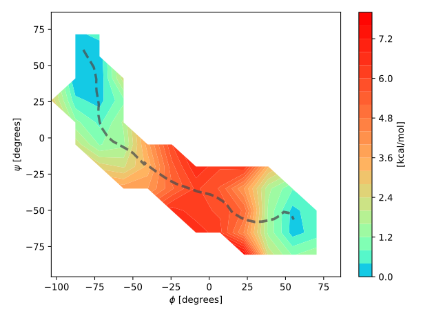

        .___     .__                         __    __         .__        ___.
      __| _/____ |  |   ____   _____   _____/  |__/  |_  ____ |  | _____ \_ |__
     / __ |/ __ \|  | _/ __ \ /     \ /  _ \   __\   __\/ __ \|  | \__  \ | __ \
    / /_/ \  ___/|  |_\  ___/|  Y Y  (  <_> )  |  |  | \  ___/|  |__/ __ \| \_\ \
    \____ |\___  >____/\___  >__|_|  /\____/|__|  |__|  \___  >____(____  /___  /
         \/    \/          \/      \/                       \/          \/    \/

    by Oliver Fleetwood, Sergio Pérez-Conesa and Marko Petrovic 2017-2020.
    https://github.com/delemottelab/string-method-gmxapi



This repository contains an implementation of the string method with swarms of
trajectories [[1,2]](#references)
using [GROMACS' python API](http://manual.gromacs.org/current/gmxapi/userguide/usage.html)[[3,4]](#references).

# Using the code

## Python dependencies

+ [gmxapi](http://manual.gromacs.org/current/gmxapi/userguide/usage.html)
linked to [GROMACS](http://manual.gromacs.org/).
+ [numpy](https://numpy.org/)
+ [mpi4py](https://mpi4py.readthedocs.io/en/stable/index.html)
+ [dataclasses](https://anaconda.org/conda-forge/dataclasses)
+ [typing](https://anaconda.org/anaconda/typing)
+ [matplotlib](https://matplotlib.org/) (analysis only)

We plan on automating dependency management with pip or conda.

The environment.yml contains library versions for which the package has been
tested. The package has been tested with GROMACS2020.2.

## Preparing the files

To launch a simulation you first need to set up a system (start.gro, topol.top,
index.ndx), configure Collective Variables (CVs; a.k.a reaction coordinates)
with GROMACS' pull code (restrained.mdp, swarms.mdp, steered.mdp), and provide
an initial string (string0.txt).
We recommend you to use one of the [examples below](#examples) as a template.
There is also a [start-up](#examples/start-up/) walks you through file preparation,
 steering simulations, running of the string method and analysis using jupyter
 notebooks and instructions.


### Molecular Dynamics Properties (MDP) files

#### Steered MD (preprocessing step) files

**steered.mdp**

Contains the settings to run a steered MD with pull code restraints between two
beads on your input string.

In addition to this you need start coordinates to your steered MD simulation
(default name **start.gro**) and a string0.txt.

The steered MD engine will generate a simulation that steers the system from
start.gro through the beads in string0.txt and generates for each of them a
simulation folder in `md/0/`

#### String method files

You need two `mdp` files:

**restrained.mdp**

Contains the settings to run a short equilibration with pull code restraints
before launching the swarms. All required pull code parameters except for
`pull-code-init` should be set in this file. It is likely very similar to `steered.mdp`.

**swarms.mdp**

Contains the settings to run the unrestrained swarm simulations.
Note that you still need to define the pull code properties in this file to
print the CV values to a xvg-file, but no force should be applied.
This is acheived by seeting `pull-coord-k=0`.

**Pull code MDP example**

```
pull = yes
pull-ngroups = 2
pull-group1-name = residue_1 ; name of groups defined in the index file
pull-group2-name = residue_2

; Define the first collective variable (CV)
pull-ncoords = 1
pull-coord1-geometry = distance
pull-coord1-groups = 1 2 ; Center of mass distnace between the two groups
pull-coord1-k = 0 ; strength of harmonic potential. Set to a high value in
restrained.mdp and to 0 in swarms.mdp
; .... Define more CVs below

; Handle output
pull-print-components = no ; output pull coordinates
pull-nstxout = 50000 ; Step interval to output the coordinate values to the pullx.xvg. Should match the 'nstepsä property
pull-nstfout = 0
```

### Topology

You need to have a valid topology file called **topol.top** and an index file
called **index.ndx**.The index file should define all groups used by the pull code.

### Input string

#### String files

You define your initial pathway in a [numpy.txt](https://numpy.org/doc/stable/reference/generated/numpy.loadtxt.html)
format called `string0.txt`.
Every row in your file defines the CV coordinates for a bead on the string.
The first column refers to the first CV/pull coordinate etc.

#### Input coordinates

**Note**: unless you have a trajectory to derive input coordinates from,
we recommend you to you steered-MD to initialize the simulation.
If you use the steeredMD script (```python main.py --start_mode=steered```),
the string input will be prepared for you. You can use [start-up](#examples/start-up)
for this.

For every bead on your string your need a snapshot with all atom
coordinates called **confout.gro**. Create one directory per bead and put the
corresponding snaphot in that directory according to the layout below. I. e.
`md/0/0/restrained/confout.gro`, `md/0/1/restrained/confout.gro`,
`md/0/2/restrained/confout.gro`, ...
You don't need to provide .gro-files for the first and last bead on the string
if your endpoints are fixed, which is the default.

Note that these snapshots should be well-equilibrated and be *close* to the
coordinates defined in **string0.txt**. This can for example be acheived by
running steered-MD along your initial string between two endpoints.
The string simulation will only equilibrate the system according to `nsteps`
in **restrained.mdp**.

### File organization
We recommend you to organize your simulation files according to the following default layout:
```
simulation_directory
├── config.json
├── md
│   └── 0
│       ├── 0
│       │   └── restrained
│       │       └── confout.gro
│       ├── 1
│       │   └── restrained
│       │       └── confout.gro
│       ├── 2
│       │   └── restrained
│       │       └── confout.gro
        ...
├── mdp
│   ├── restrained.mdp
│   └── swarms.mdp
│   └── steered.mdp
├── strings.txt
│   ├── rescale_string.py
│   ├── string0-scaled.txt
│   └── string0.txt
└── topology
    ├── end.gro
    ├── index.ndx
    ├── start.gro
    ├── topol.top

```
As the program progresses it will create new directories in the **md** directory, one new directory for every string iterations.
At the end of every iteration, it will output new string coordinates **strings/string1.txt**, **strings/string2.txt**", etc.

We know it requires some effort to get started, but the [start-up](#examples/start-up/)
should make it much easier for you.

### config.json (optional)
This JSON file will be loaded as a ` Config` object defined in **stringmethod/config.py**.
You can override parameters such as:

+ swarm_size=int (default: 32). The number of trajectories in a swarm.
+ max_iterations=int (default: 100). The maximum number of iterations before
the program automatically goes into processing.
+ fixed_endpoints=true/false (default: false). If the endpoints should be fixed
or not.
 Fixed endpoints will not be updated between iterations.
 No swarm trajectories will be launched from the endpoints.
You can also change the location of the input/output directories.
+ mdrun_options_restrained=list_of_strings (default: [ ] ). Takes a list of strings
 that will be passed to gmxapi as `mdrun` options in steering simulations.
 For example: ["-nt","4"] will make each restrained simulation launched run with
 4 threads.
+ mdrun_options_swarms=list_of_strings (default: [ ] ).
 Same as mdrun_options_stereed but for swarm simulations.
+ mdrun_options_restrained=list_of_strings (default: [ ] ).
 Same as mdrun_options_stereed but for restrained simulations.
+ grompp_options=list_of_strings (default: []).
 Options for grompp commands. Usefull for example to add ["-maxwarn", "1"].
+ gpus_per_node=int (default: None). Number of GPUs per node. If more than one
node is used all nodes must have the same number of GPUs.

## Running a string simulation

The main entry point to start a program is via `main.py` with the optional
parameters  `iteration`, `start_mode` and `config_file`.
You can also write your own python wrapper and import the stringmethod module.
The program can run either in an MPI environment, automatically distributing
the work to multiple nodes, or on a single machine.


### Running on a single machine

```bash
python main.py --config_file=config.json
```

This will run all the simulations in sequential order, first restrained simulations
all beads, then all swarm trajectories per bead.
Here we've also provided an optional config file.
You can also set the parameter `start_mode=steered` or `start_mode=postprocessing`
to run steeredMD or postprocessing.

Postprocessing computes the free energy surface and generates the count matrix.

In practice, unless the machine has hardware acceleration (i.e. a GPU) you
probably need to run the string method in a distributed environment.

### Running with MPI in a HPC environment

The string method is well-suited for distributed computing,
where the independent MD simulations run in parallel with very little inter-process communication.
The program implements a master-slave architecture for running multi-node simulations.
One MPI rank, i.e. the master, won't run GROMACS; it will run the main python script and tell all the other MPI ranks what to do.
The other MPI ranks, the slaves, will receive instructions on what GROMACS commands to execute from the master.
When they are finished they'll notify the master and receive new jobs, if there are any.

If the nodes of your HPC cluster are GPU nodes, this is also of great advantage.
In this case you will set up one mpi rank per-GPU. In this way, you will have one
simulation running per GPU in parallel each with one GPU, one mpi-rank and as many
threads as you can distribute per mpi rank.

To see details on the parallelization and performance enhancement of the string
method please read in detail [PERFORMANCE.md](#PERFORMANCE.md). You also have
slurm script files in [start-up](#examples/start-up/).

### Handling restarts

You can just start the script the same way as you did the first time, it will
figure out where it was before.
Optionally you can start the python script with a flag --iteration=X,
then it will start from that step directly. In this way, you don't spend time checking
that all files are there which can be slow if many iterations have been already run.


### Recovering after a crash

Assume that your simulation files are corrupt or that you realize your mdp
options are incorrect, and you need to rerun part of the simulation.
Since the files are organized in a tree structure, it's easy to delete the
directory of a failing iteration or point.
Then when you restart that directory will be recreated.

To avoid the generation of corrupt files, each slurm submission should generate
an integer number of iterations before exiting thus avoiding terminating the
slurm job with a time-out. The slurm files in [start-up](#examples/start-up/)
are configured to this effect.

# Convergence of the string and free energy landscapes

There is a log message written at the end of every iteration about string convergence.
The convergence is measured as:

[|\bar{s}_{i}-\bar{s}_{i-1}|/(0.5*(|\bar{s}_{i}|+|\bar{s}_{i-1}|))]::


where 
are the string coordinates at the end of iteration `i`, scaled between their max and min values.
Since you can expect some fluctuations or the drift to vary in speed depending on your Free Energy (FE) surface, this may not be a perfect metric.
You can compute this metric for strings over many iterations apart, which gives you a better view of the long-term convergence.
There's an example python script on how to do this in examples/alanine-dipeptide.

Then there's the convergence of the free energy landscapes, which is not exactly the same thing.
For that you have two options: the easy one is to compute the free energy landscape between iterations x and y,
then compare it to the landscape between iterations y+1 and z.
Another solution is to the take the transition counts you get from this repository,
feed it to pyEmma or MSMBuilder and run Markov chain Monte Carlo bootstrapping.
The advantage of the latter is that you can get a better view of convergence without having to run that long.


You can have a perfectly converged string and not have a converged free energy landscape.
The reason is that you need multiple transitions between bins to converge the free energy landscape.
Convergence of the string just requires the drift of the swarm to be low.
If you have high free energy barriers you still need transitions along them to get a FE landscape.

# Examples
In the **examples** directory you'll find complete sets of input files for running a simulation.
These can be used for testing your python environment or as a template to set up your own simulation.

## Alanine dipeptide in vaccuum
We analyze the transition between two metastable states of alanine dipeptide using the two dihedral angles ϕ and Ψ.
This simulation can run on a regular laptop. Using GPU acceleration in this small system may result in slower simulations.

## beta2: G protein-coupled receptor (GPCR) activation
We study the beta2 adrenergic receptor in its native apo state using five C-alpha distances as CVs.
Read [our paper [2]](https://doi.org/10.1021/acs.biochem.9b00842) for more details.
This simulation takes time. To obtain useful results you need a desktop with a good GPU or an HPC environment.

## Start-up: tutorial/how to.
In this example you will find instructions and jupyter notebooks to prepare input
files, run steering simulations, run string simulations and analise the results.
The example is carried out with the beta2 receptor but can be adapted to any
problem.

# References
1. Pan, Albert C., Deniz Sezer, and Benoît Roux. "Finding transition pathways using the string method with swarms of trajectories." The journal of physical chemistry B 112.11 (2008): 3432-3440.
2. Fleetwood, Oliver, et al. "Energy Landscapes Reveal Agonist Control of G Protein-Coupled Receptor Activation via Microswitches." Biochemistry 59.7 (2020): 880-891.
3. Abraham, Mark James, et al. "GROMACS: High performance molecular simulations through multi-level parallelism from laptops to supercomputers." SoftwareX 1 (2015): 19-25.
4. Irrgang, M. Eric, Jennifer M. Hays, and Peter M. Kasson. "gmxapi: a high-level interface for advanced control and extension of molecular dynamics simulations." Bioinformatics 34.22 (2018): 3945-3947.
